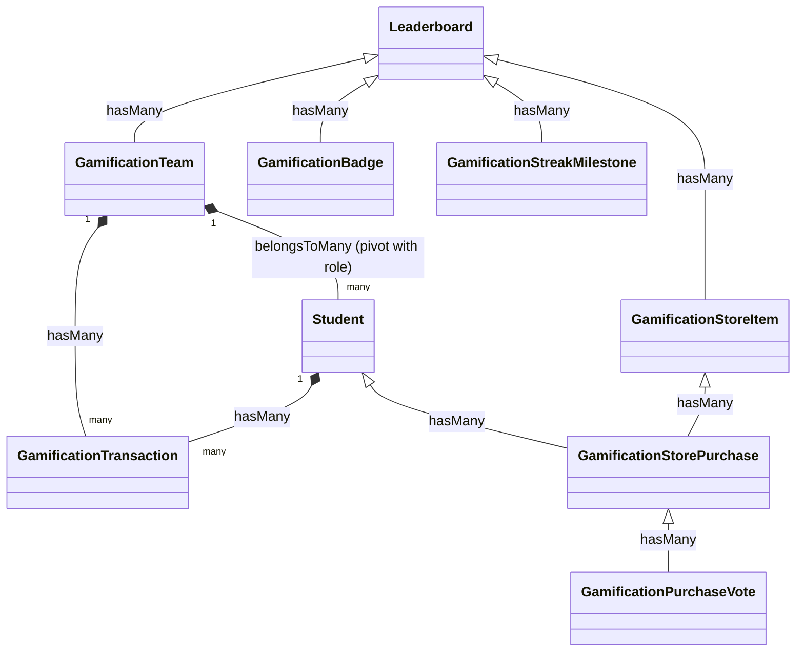

# نظام التلعيب (Gamification System) - المواصفات والتصميم الفني

مستند للتصميم المعماري وتفاصيل قاعدة البيانات والواجهات البرمجية لدمج نظام التلعيب التفاعلي في تطبيق التحفيظ.

---

## 1. البنية المعمارية وقاعدة البيانات (Database Design)

لتطبيق النظام بمرونة ودون التأثير على الجداول الحالية، سنقوم بإنشاء الجداول والروابط التالية:



### تفاصيل الجداول الجديدة (Migration Schemas)

#### جدول المسابقات (تعديل `leaderboards`):
* `competition_type`: `enum('normal', 'gamification')` (الافتراضي `normal`).
* `theme_key`: `string` (مثل `space`, `ocean`, `heroes`).

#### جدول البنود المخصصة (تعديل `leaderboard_criteria`):
* `is_enthusiasm_trigger`: `boolean` (الافتراضي `false` - لتحديد البند كمؤثر ومغذٍّ للحماسة).

#### جدول حالة الطالب في التلعيب (`gamification_student_states`):
* `id`: `bigIncrements`
* `leaderboard_id`: `foreignId` (مرتبط بـ `leaderboards`)
* `student_id`: `foreignId` (مرتبط بـ `students`)
* `coins`: `integer` (الرصيد الفردي الحالي للعملات)
* `current_streak`: `integer` (شعلة الحماسة الحالية - الأيام المتتالية)
* `max_streak`: `integer` (أعلى شعلة حماسة حققها الطالب في هذه المسابقة)
* `last_activity_date`: `date` (تاريخ آخر نشاط حماسة لتتبع استمرار المتتالية)
* `streak_freezes_count`: `integer` (عدد بطاقات تجميد الحماسة المملوكة لمنع كسر الشعلة)
* *المفاتيح:* مفتاح فريد مركّب `(leaderboard_id, student_id)`.

#### جدول الفرق/الأسر (`gamification_teams`):
* `id`: `bigIncrements`
* `leaderboard_id`: `foreignId` (مرتبط بـ `leaderboards`)
* `name`: `string`
* `coins`: `integer` (الافتراضي `0` - خزينة الفريق)
* `shield_active_until`: `timestamp` (حماية من الخصومات والهجمات)
* `multiplier_active_until`: `timestamp` (مضاعفة النقاط المكتسبة للفريق)

#### جدول أعضاء الفريق (`gamification_team_student`):
* `team_id`: `foreignId`
* `student_id`: `foreignId`
* `role`: `enum('leader', 'assistant', 'member')` (القائد، النائب، العضو)
* *المفاتيح:* مفتاح مركب وفريد `(team_id, student_id)`.

#### جدول سجل المعاملات والعمليات (`gamification_transactions`):
* `id`: `bigIncrements`
* `leaderboard_id`: `foreignId`
* `student_id`: `foreignId` (nullable - في العمليات الجماعية للفريق)
* `team_id`: `foreignId` (nullable - للعمليات المشتركة أو التبرع)
* `type`: `enum('earn', 'spend', 'donate', 'refund')`
* `amount`: `integer` (موجب للنقاط المكتسبة، سالب للمصروفات والتبرعات)
* `description`: `string` (نص توضيحي باللغة العربية لعرضه للمستخدم في كشف الحساب)
* `reference_type`: `string` (مثل `App\Models\StudentPlanDay`, `App\Models\Attendance`)
* `reference_id`: `unsignedBigInteger`

#### جدول متجر الجوائز (`gamification_store_items`):
* `id`: `bigIncrements`
* `leaderboard_id`: `foreignId`
* `name`: `string`
* `description`: `text`
* `price`: `integer` (السعر بالعملة الافتراضية)
* `item_type`: `enum('team_points', 'team_attack', 'multiplier', 'shield', 'custom')`
* `value`: `integer` (مثل عدد النقاط المضافة أو المخصومة)
* `is_active`: `boolean` (الافتراضي `true`)

#### جدول طلبات الشراء والتصويت (`gamification_store_purchases`):
* `id`: `bigIncrements`
* `store_item_id`: `foreignId`
* `student_id`: `foreignId` (مقدم الطلب)
* `team_id`: `foreignId` (nullable - للفريق)
* `status`: `enum('pending_approval', 'approved', 'rejected')`
* `price_paid`: `integer`

#### جدول تصويت الشراء (`gamification_purchase_votes`):
* `id`: `bigIncrements`
* `store_purchase_id`: `foreignId`
* `student_id`: `foreignId`
* `vote`: `boolean` (موافق `true` / رافض `false`)

#### جدول الأوسمة (`gamification_badges`):
* `id`: `bigIncrements`
* `leaderboard_id`: `foreignId`
* `name`: `string`
* `description`: `text`
* `icon`: `string` (أيقونة الوسام أو رمزها)
* `badge_type`: `enum('hifz_streak', 'attendance_streak', 'custom')`
* `requirement_value`: `integer`

#### جدول أوسمة الطلاب (`gamification_badge_student`):
* `badge_id`: `foreignId`
* `student_id`: `foreignId`
* `created_at`: `timestamp`

#### جدول معالم ومكافآت الحماسة (`gamification_streak_milestones`):
* `id`: `bigIncrements`
* `leaderboard_id`: `foreignId`
* `days_required`: `integer` (عدد الأيام المتتالية المطلوبة، مثل 5، 10، 30)
* `reward_xp`: `integer` (نقاط الخبرة الممنوحة كهدية)
* `reward_coins`: `integer` (العملات الممنوحة كهدية)
* `reward_badge_id`: `foreignId` (nullable - وسام تذكاري يُربط ويُمنح مع الجائزة)
* `description`: `string` (وصف المكافأة، مثل "حافز الحماسة الذهبي")

#### جدول جوائز الحماسة المستلمة (`gamification_claimed_milestones`):
* تتبع الجوائز المستلمة ومنع التكرار اللحظي، مع السماح بكسبها مجدداً عند كسر المتتالية والبدء من الصفر:
* `id`: `bigIncrements`
* `student_id`: `foreignId`
* `milestone_id`: `foreignId`
* `claimed_at`: `timestamp`
* `streak_run_count`: `integer` (عدد المتتالية التي تم الصرف عندها، للتحقق من عدم الصرف مرتين في نفس خط الحماسة المستمر)

#### جدول مستويات التلعيب للمسابقة (`gamification_levels`):
* لتخزين مستويات المسابقة المحددة والـ XP المطلوبة لكل مستوى لتسهيل التخصيص والاستعلام السريع:
* `id`: `bigIncrements`
* `leaderboard_id`: `foreignId` (مرتبط بـ `leaderboards`)
* `level_number`: `integer` (رقم المستوى، مثل 1، 2، 3)
* `name`: `string` (اسم المستوى المخصص، مثل "نجم مبتدئ")
* `xp_required`: `integer` (نقاط الـ XP المطلوبة للوصول وتفعيل هذا المستوى)
* `icon`: `string` (رمز الأيقونة المقترنة بالمستوى)

---

## 2. خدمة إعدادات الطوابع (Themes Configurations)

تتحكم فئة الخدمة `GamificationThemeService` بالهوية البصرية والمسميات لكل مسابقة تلعيب بناءً على الطابع المختار:

| الطابع (Theme) | نقاط الخبرة (XP) | العملة (Currency) | اسم الفريق | المستويات المقترحة (Levels) |
| :--- | :--- | :--- | :--- | :--- |
| **الفضاء (Space)** | طاقة الخبرة | بلورات كوكب | سفينة فضائية | نجم مبتدئ -> مستكشف الكواكب -> ملاح المجرة -> قائد المركبة -> أمير الفضاء |
| **أعماق البحار (Ocean)** | قوة الإبحار | لآلئ المحيط | سفينة بحرية | بحار مبتدئ -> غواص الأعماق -> صياد الكنوز -> قبطان البحار -> ملك المحيط |
| **أبطال وتاريخ (Heroes)** | الهيبة والمجد | دنانير ذهبية | كتيبة الفرسان | فارس متدرب -> محارب شجاع -> قائد فرسان -> حارس القلعة -> الفارس الأسطوري |

---

## 3. آلية تتبع ومزامنة الحسابات (Transactions ledger)

لتفادي الاستعلامات الثقيلة وعمليات الـ Joins المعقدة عند عرض لوحات الصدارة، يُدار رصيد الطلاب والفرق عبر **المزامنة اللحظية (Immediate Sync)**:

1. **تسميع حفظ/مراجعة:**
   عند استدعاء المعلم لتقييم الحفظ أو المراجعة، يتم استدعاء الخدمة لمزامنة المعاملة:
   ```php
   GamificationService::syncStudentPlanDayXP($studentPlanDay);
   ```
2. **التحضير والحضور:**
   عند تحضير المعلم للطلاب (حاضر، متأخر):
   ```php
   GamificationService::syncStudentAttendanceXP($attendance);
   ```
3. **التبرع للفريق:**
   يتم خصم المبلغ من الطالب وإضافته لخزينة الفريق في عملية قاعدة بيانات واحدة (Database Transaction).
4. **المتجر والتصويت:**
   عند شراء ميزة جماعية، يُنشأ طلب حالة `pending_approval`. يرسل إشعاراً للأعضاء للتصويت. فور تحقيق شرط الموافقة (مثال: موافقة الأغلبية أو القائد والنائب)، تُخصم العملات وتُفعل الميزة (مثل إضافة درع حماية للفريق يمنع الخصومات لمدة 24 ساعة).

---

## 4. مكونات واجهة التفاعل (Livewire Components)

### أ) لوحة الطالب الملعّبة (`⚡gamification-panel`):
* تصميم فاخر يحتوي على صورة بطاقة الطالب وتفاصيل مستواه الحالي وشريط التقدم بشكل ثلاثي أبعاد تفاعلي (Glassmorphism).
* عرض رصيد العملات الحالية.
* إحصائيات الفريق والترتيب على مستوى الحلقة.
* صندوق المشتريات والتبرع والتصويت السريع.

### ب) المتجر (`⚡gamification-store`):
* بطاقات ملونة لعناصر المتجر مع ميكرو-أنيميشن عند مرور الماوس (Hover).
* إمكانية شراء "مضاعف نقاط" أو "درع حماية للفريق" مع عد تنازلي للدرع النشط.

### ج) إدارة الأوسمة والشارات (`⚡gamification-badges`):
* شبكة عرض (Grid) للأوسمة الحاصل عليها الطالب بألوانها الزاهية، مع إبراز الأوسمة غير المكتملة بلون رمادي وتفاصيل المتطلبات عند النقر عليها.

---

## 5. أيام الحماسة (Streak System - شعلة الحماسة 🔥)

يعد نظام أيام الحماسة اختيارياً وقابلاً للضبط بالكامل من قبل المشرف لكل مسابقة تلعيب:

### أ) خيارات التخصيص للمشرف (Customizable Options):
* **حالة التفعيل:** إمكانية تشغيل أو إيقاف النظام بالكامل للمسابقة.
* **البنود والمحفزات المؤهلة (Streak Triggers):** يمكن للمشرف تحديد أي من الأنشطة التالية يحتسب لتغذية واستمرار متتالية الحماسة اليومية:
  - **الحضور والغياب:** (حاضر أو متأخر).
  - **الإنجاز القرآني التلقائي:** (حفظ أو مراجعة) مع تحديد الحد الأدنى للتقييم المقبول (ممتاز أو جيد).
  - **البنود المخصصة (Custom Criteria):** يمكن اختيار بنود تقييم محددة (مثل: الانضباط، الأخلاق، التواجد المبكر) وتفعيل خيار `is_enthusiasm_trigger` عليها، بحيث إذا حصل الطالب على نقاط فيها خلال اليوم، يستمر خط حماسته.
* **مكافآت المتتالية الهيكلية (Streak Milestones):** يتم تحديد جوائز متدرجة عند تحقيق عدد محدد من الأيام المتتالية (تخزن في جدول مخصص)، وتحتوي على عملات إضافية، نقاط خبرة إضافية (XP)، وأوسمة خاصة تُمنح تلقائياً.

### ب) آلية الاحتساب والمزامنة (Streak Engine):
1. **تحديث النشاط اليومي:** 
   في كل مرة يتم فيها رصد حضور أو حفظ تقييم إنجاز أو رصد بند مخصص مؤهل، يقوم النظام باستدعاء دالة المزامنة:
   ```php
   GamificationService::updateStudentStreak($student, $date);
   ```
2. **التحقق من التوالي (Streak Logic):**
   - إذا كان التاريخ يساوي اليوم التالي لـ `last_activity_date`: يتم زيادة شعلة الحماسة `current_streak++`.
   - إذا كان التاريخ يساوي نفس يوم `last_activity_date`: لا يتغير العداد (الطالب قام بالفعل بنشاطه اليوم).
   - إذا كان هناك فجوة زمنية (يوم أو أكثر لم يقم بالنشاط المطلوب):
     - يتم التحقق من توفر **بطاقة تجميد الحماسة (Streak Freeze)** لدى الطالب.
     - إذا كانت متوفرة: يتم استهلاكها تلقائياً (`streak_freezes_count--`) ويبقى العداد كما هو، وتتحدث `last_activity_date` إلى يوم الغياب كأنه نشط.
     - إذا لم تكن متوفرة: تنطفئ الشعلة ويعود العداد `current_streak = 1` عند تسجيل النشاط الجديد.
3. **رصد الأرقام القياسية (Max Streak):**
   إذا تجاوزت الحماسة الحالية الرقم القياسي `current_streak > max_streak` يتم تحديث `max_streak = current_streak`.
4. **تسجيل المكافآت:**
   فور وصول العداد لأحد المعالم المحددة (Milestones)، يتم صرف المكافأة تلقائياً وتسجيلها في جدول العمليات `gamification_transactions` مع توثيق ذلك لمنع الصرف المتكرر لنفس دورة خط الحماسة.

### ج) واجهة الطالب الجزئية لأيام الحماسة (`⚡enthusiasm-widget`):
تظهر هذه الواجهة الجذابة للطالب في **أعلى لوحة التحكم الرئيسية مباشرة** وتحتوي على:
1. **شعلة حماسة مضيئة (Hype Flame 🔥):** تعرض عدد الأيام الحالي (مثال: `7 أيام متتالية!`) بنمط بصري مشع يتغير لونه وتأثيره الحركي كلما زاد الرقم.
2. **خط زمن المكافآت (Milestones Timeline):**
   - يعرض الجوائز التي يسعى الطالب لتحقيقها حالياً كمحطات متتالية على مسار تقدم أفقي.
   - يعرض علامة (صح) أو قفل مفتوح على الجوائز التي تم استلامها بالفعل في خط الحماسة الحالي.
3. **مؤشر الحماية:** يعرض ما إذا كان لدى الطالب "بطاقة تجميد الحماسة" نشطة أو متوفرة لحمايته من الغياب اليوم.

---

## 6. التعايش المشترك والواجهة التلقائية (Dashboard Override & Coexistence)

لضمان تجربة مستخدم تفاعلية متكاملة دون التأثير على النظام القائم:

### أ) التعايش جنباً إلى جنب (Coexistence):
* يعمل نظام مسابقات التلعيب (Gamification) كفصل منفصل تماماً وموازٍ لنظام المسابقات التقليدي الحالي.
* يتم تسجيل ومعالجة نقاط الـ XP والعملات والحماسة في جداول التلعيب الجديدة دون التأثير على نقاط المسابقات العادية أو تقاريرها.

### ب) التبديل التلقائي للوحة التحكم (Dashboard Auto-Override):
* يبقى مسار لوحة تحكم الطالب موحداً وهو `/student/dashboard`.
* عند تحميل الصفحة، يقوم مكون Livewire بالتحقق ديناميكياً:
  1. **إذا لم تكن هناك مسابقة تلعيب نشطة** تشمل الطالب: يتم عرض لوحة التحكم التقليدية الحالية (الخطط والتحضير العادي).
  2. **إذا كانت هناك مسابقة تلعيب نشطة:** يتم إخفاء الواجهة العادية تماماً، وعرض **لوحة التحكم الملعّبة (Gamified Dashboard)** التي تتبنى الطابع المختار (الفضاء، البحار، الأبطال) بجميع ألوانه، وتأثيراته البصرية، ومسميات عملاته ومستوياته تلقائياً، مع عرض شعلة الحماسة في الأعلى.
